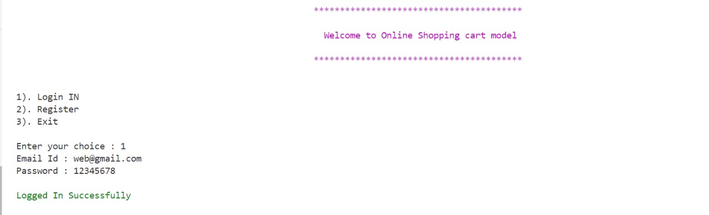

# Online Shopping Cart Model

## Overview

This project is a terminal-based online shopping cart model implemented in Java. It demonstrates core concepts of Object-Oriented Programming (OOP) such as polymorphism, abstraction, custom exception handling, file handling, inheritance, and encapsulation.

## Features

- **Polymorphism**: Different types of products are handled through a common interface.
- **Abstraction**: Simplified interfaces for adding, removing, and viewing products in the cart.
- **Custom Exception Handling**: Specific exceptions are defined and managed to handle various error scenarios.
- **File Handling**: Cart data is saved to and loaded from files to persist user data.
- **Inheritance**: A hierarchical relationship between different product types.
- **Encapsulation**: Internal data and implementation details are hidden from the user.

## Getting Started

### Prerequisites

- Java Development Kit (JDK) installed on your machine

### Installation

1. Clone the repository:
   ```sh
   git clone https://github.com/07aagamshah04/Online-Shopping-Cart-Model.git

### For Example




